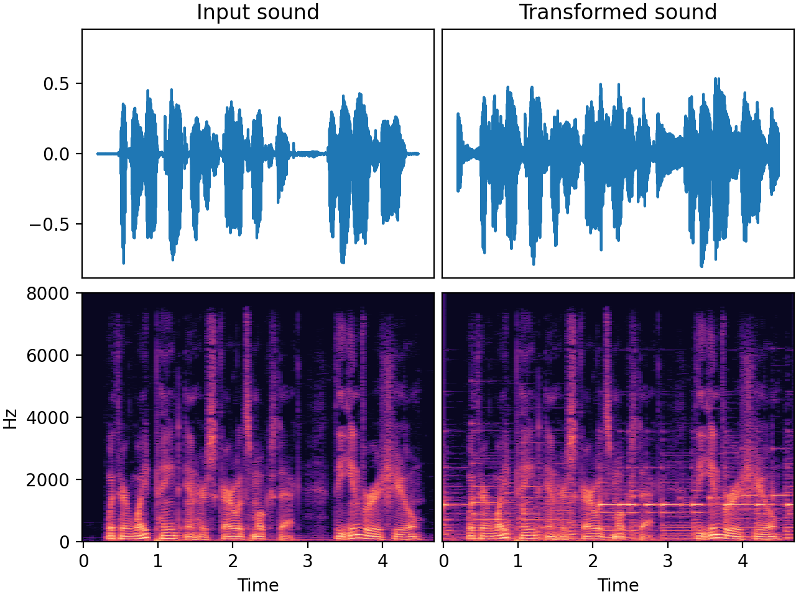

# `AddBackgroundNoise`

_Added in v0.9.0_

Mix in another sound, e.g. a background noise. Useful if your original sound is clean and
you want to simulate an environment where background noise is present.

Can also be used for mixup, as in [https://arxiv.org/pdf/1710.09412.pdf](https://arxiv.org/pdf/1710.09412.pdf)

A folder of (background noise) sounds to be mixed in must be specified. These sounds should
ideally be at least as long as the input sounds to be transformed. Otherwise, the background
sound will be repeated, which may sound unnatural.

Note that the gain of the added noise is relative to the amount of signal in the input. This
implies that if the input is completely silent, no noise will be added.

Here are some examples of datasets that can be downloaded and used as background noise:

* [https://github.com/karolpiczak/ESC-50#download](https://github.com/karolpiczak/ESC-50#download)
* [https://github.com/microsoft/DNS-Challenge/](https://github.com/microsoft/DNS-Challenge/)

## Input-output example

Here we add some music (with SNR = 5.0 dB) to a speech recording



| Input sound                                                                               | Transformed sound                                                                               |
|-------------------------------------------------------------------------------------------|-------------------------------------------------------------------------------------------------|
| <audio controls><source src="../AddBackgroundNoise_input.flac" type="audio/flac"></audio> | <audio controls><source src="../AddBackgroundNoise_transformed.flac" type="audio/flac"></audio> | 

## Usage examples


=== "Relative RMS"

    ```python
    from audiomentations import AddBackgroundNoise, PolarityInversion
    
    transform = AddBackgroundNoise(
        sounds_path="/path/to/folder_with_sound_files",
        min_snr_in_db=3.0,
        max_snr_in_db=30.0,
        noise_transform=PolarityInversion(),
        p=1.0
    )
    
    augmented_sound = transform(my_waveform_ndarray, sample_rate=16000)
    ```

=== "Absolute RMS"

    ```python
    from audiomentations import AddBackgroundNoise, PolarityInversion
    
    transform = AddBackgroundNoise(
        sounds_path="/path/to/folder_with_sound_files",
        noise_rms="absolute",
        min_absolute_rms_in_db=-45.0,
        max_absolute_rms_in_db=-15.0,
        noise_transform=PolarityInversion(),
        p=1.0
    )
    
    augmented_sound = transform(my_waveform_ndarray, sample_rate=16000)
    ```

## AddBackgroundNoise API

`sounds_path`: `Union[List[Path], List[str], Path, str]`
:   :octicons-milestone-24: A path or list of paths to audio file(s) and/or folder(s)
    with audio files. Can be str or Path instance(s). The audio files given here are
    supposed to be background noises.

`min_snr_in_db`: `float` (unit: Decibel)
:   :octicons-milestone-24: Default: `3.0`. Minimum signal-to-noise ratio in dB. Is only
    used if `noise_rms` is set to "relative"

`max_snr_in_db`: `float` (unit: Decibel)
:   :octicons-milestone-24: Default: `30.0`. Maximum signal-to-noise ratio in dB. Is
    only used if `noise_rms` is set to "relative"

`noise_rms`: `str` (choices: `"absolute"`, `"relative"`)
:   :octicons-milestone-24: Default: `"relative"`. Defines how the background noise will
    be added to the audio input. If the chosen option is `"relative"`, the rms of the
    added noise will be proportional to the RMS of the input sound. If the chosen option
    is `"absolute"`, the background noise will have a RMS independent of the rms of the
    input audio file

`min_absolute_rms_in_db`: `float` (unit: Decibel)
:   :octicons-milestone-24: Default: `-45.0`. Is only used if `noise_rms` is set to
    `"absolute"`. It is the minimum RMS value in dB that the added noise can take. The
    lower the RMS is, the lower the added sound will be.

`max_absolute_rms_in_db`: `float` (unit: Decibel)
:   :octicons-milestone-24: Default: `-15.0`. Is only used if `noise_rms` is set to
    `"absolute"`. It is the maximum RMS value in dB that the added noise can take. Note
    that this value can not exceed 0.

`noise_transform`: `Optional[Callable[[np.ndarray, int], np.ndarray]]`
:   :octicons-milestone-24: Default: `None`. A callable waveform transform (or
    composition of transforms) that gets applied to the noise before it gets mixed in.

`p`: `float`
:   :octicons-milestone-24: Default: `0.5`. The probability of applying this transform.

`lru_cache_size`: `int`
:   :octicons-milestone-24: Default: `2`. Maximum size of the LRU cache for storing noise files in memory
