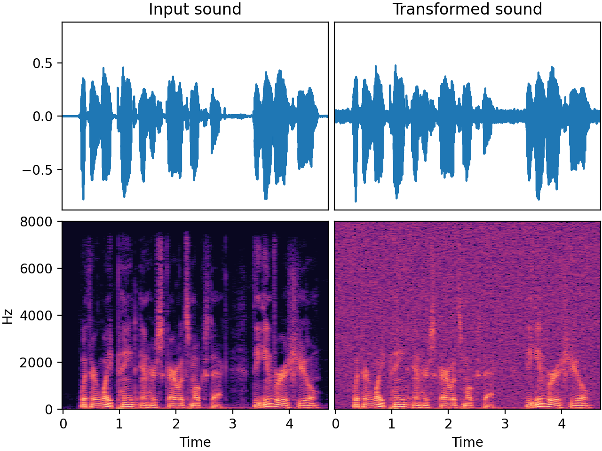

# `AddGaussianSNR`

_Added in v0.7.0_

The `AddGaussianSNR` transform injects Gaussian noise into an audio signal. It applies
a **Signal-to-Noise Ratio (SNR)** that is chosen randomly from a **uniform distribution on the
decibel scale**. This choice is consistent with the nature of human hearing, which is
logarithmic rather than linear.

**SNR** is a common measure used in science and engineering to compare the level of a
desired signal to the level of noise. In the context of audio, the signal is the
meaningful sound that you're interested in, like a person's voice, music, or other
audio content, while the noise is unwanted sound that can interfere with the signal.

The SNR quantifies the ratio of the power of the signal to the power of the noise. **The
higher the SNR, the less the noise** is present in relation to the signal.

**Gaussian noise**, a kind of white noise, is a type of statistical noise where the
amplitude of the noise signal follows a Gaussian distribution. This means that most of
the samples are close to the mean (zero), and fewer of them are farther away. It's
called Gaussian noise due to its characteristic bell-shaped Gaussian distribution.

Gaussian noise is similar to the sound of a radio or TV tuned to a nonexistent station:
a kind of **constant, uniform hiss or static**.

## Input-output example

Here we add some gaussian noise (with SNR = 16 dB) to a speech recording.



| Input sound                                                                             | Transformed sound                                                                             |
|-----------------------------------------------------------------------------------------|-----------------------------------------------------------------------------------------------|
| <audio controls><source src="../AddGaussianSNR_input.flac" type="audio/flac"></audio> | <audio controls><source src="../AddGaussianSNR_transformed.flac" type="audio/flac"></audio> | 

## Usage example

```python
from audiomentations import AddGaussianSNR

transform = AddGaussianSNR(
    min_snr_db=5.0,
    max_snr_db=40.0,
    p=1.0
)

augmented_sound = transform(my_waveform_ndarray, sample_rate=16000)
```

## AddGaussianSNR API

[`min_snr_db`](#min_snr_db){ #min_snr_db }: `float` • unit: Decibel
:   :octicons-milestone-24: Default: `5.0`. Minimum signal-to-noise ratio in dB. A lower
    number means more noise.

[`max_snr_db`](#max_snr_db){ #max_snr_db }: `float` • unit: decibel
:   :octicons-milestone-24: Default: `40.0`. Maximum signal-to-noise ratio in dB. A
    greater number means less noise.

[`min_snr_in_db`](#min_snr_in_db){ #min_snr_in_db }: `float` • unit: Decibel
:   :warning: Deprecated as of v0.31.0. Use [`min_snr_db`](#min_snr_db) instead

[`max_snr_in_db`](#max_snr_in_db){ #max_snr_in_db }: `float` • unit: decibel
:   :warning: Deprecated as of v0.31.0. Use [`max_snr_db`](#max_snr_db) instead

[`p`](#p){ #p }: `float` • range: [0.0, 1.0]
:   :octicons-milestone-24: Default: `0.5`. The probability of applying this transform.
