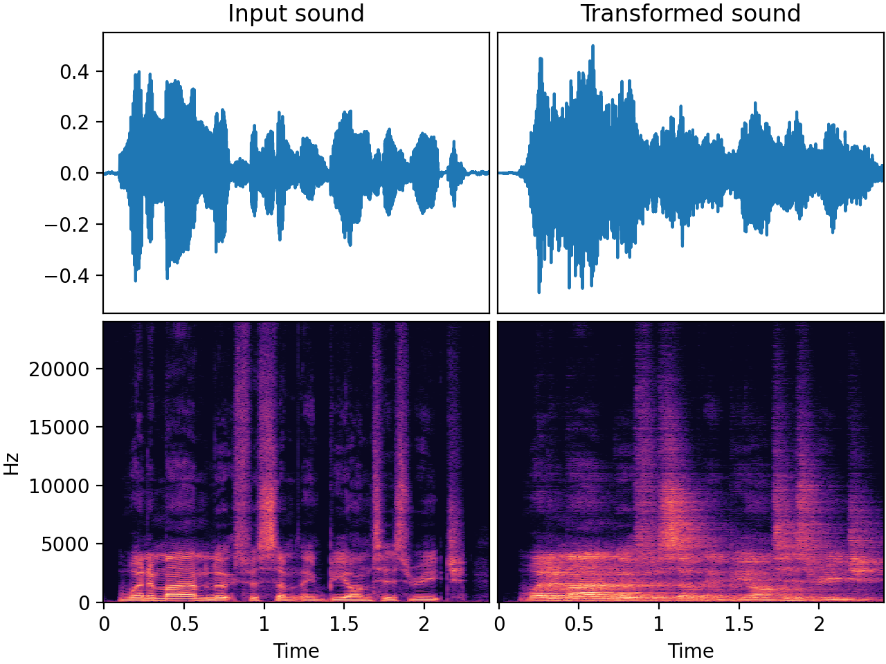

# `ApplyImpulseResponse`

_Added in v0.7.0_

This transform convolves the audio with a randomly selected (room) impulse response file.

`ApplyImpulseResponse` is commonly used as a data augmentation technique that adds
**realistic-sounding reverb** to recordings. This can for example make denoisers and speech
recognition systems more robust to different acoustic environments and distances between
the sound source and the microphone. It could also be used to generate roomy audio
examples for the training of dereverberation models.

Convolution with an impulse response is a powerful technique in signal processing that
can be employed to emulate the acoustic characteristics of specific environments or
devices. This process can transform a dry recording, giving it the sonic signature of
being played in a specific location or through a particular device.

**What is an impulse response?** An impulse response (IR) captures the unique acoustical
signature of a space or object. It's essentially a recording of how a specific
environment or system responds to an impulse (a short, sharp sound). By convolving
an audio signal with an impulse response, we can simulate how that signal would sound in
the captured environment.

Note that some impulse responses, especially those captured in larger spaces or from
specific equipment, can introduce a noticeable delay when convolved with an audio
signal. In some applications, this delay is a desirable property. However, in some other
applications, the convolved audio should not have a delay compared to the original
audio. If this is the case for you, you can align the audio afterwards with
[fast-align-audio :octicons-link-external-16:](https://github.com/nomonosound/fast-align-audio), for example.

Impulse responses can be created using e.g. [http://tulrich.com/recording/ir_capture/ :octicons-link-external-16:](http://tulrich.com/recording/ir_capture/)

Some datasets of impulse responses are publicly available:

* [EchoThief :octicons-link-external-16:](http://www.echothief.com/) containing 115 impulse responses acquired in a
 wide range of locations.
* [The MIT McDermott :octicons-link-external-16:](https://mcdermottlab.mit.edu/Reverb/IR_Survey.html) dataset
 containing 271 impulse responses acquired in everyday places.

Impulse responses are represented as audio (ideally wav) files in the given `ir_path`.

Another thing worth checking is that your IR files have the same sample rate as your
audio inputs. Why? Because if they have different sample rates, the internal resampling
will slow down execution, and because some high frequencies may get lost.

## Input-output example

Here we make a dry speech recording quite reverbant by convolving it with a room impulse response



| Input sound                                                                                 | Transformed sound                                                                                 |
|---------------------------------------------------------------------------------------------|---------------------------------------------------------------------------------------------------|
| <audio controls><source src="../ApplyImpulseResponse_input.flac" type="audio/flac"></audio> | <audio controls><source src="../ApplyImpulseResponse_transformed.flac" type="audio/flac"></audio> | 

## Usage example

```python
from audiomentations import ApplyImpulseResponse

transform = ApplyImpulseResponse(ir_path="/path/to/sound_folder", p=1.0)

augmented_sound = transform(my_waveform_ndarray, sample_rate=48000)
```

## ApplyImpulseResponse API

[`ir_path`](#ir_path){ #ir_path }: `Union[List[Path], List[str], str, Path]`
:   :octicons-milestone-24: A path or list of paths to audio file(s) and/or folder(s) with
    audio files. Can be `str` or `Path` instance(s). The audio files given here are
    supposed to be (room) impulse responses.

[`p`](#p){ #p }: `float` • range: [0.0, 1.0]
:   :octicons-milestone-24: Default: `0.5`. The probability of applying this transform.

[`lru_cache_size`](#lru_cache_size){ #lru_cache_size }: `int`
:   :octicons-milestone-24: Default: `128`. Maximum size of the LRU cache for storing
    impulse response files in memory.

[`leave_length_unchanged`](#leave_length_unchanged){ #leave_length_unchanged }: `bool`
:   :octicons-milestone-24: Default: `True`. When set to `True`, the tail of the sound
    (e.g. reverb at the end) will be chopped off so that the length of the output is
    equal to the length of the input.
