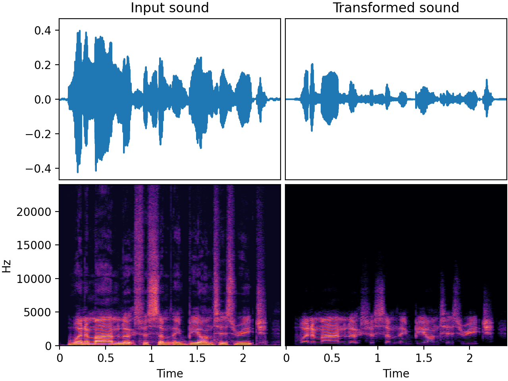

# `BandPassFilter`

_Added in v0.18.0, updated in v0.21.0_

Apply band-pass filtering to the input audio. Filter steepness (6/12/18... dB / octave)
is parametrized. Can also be set for zero-phase filtering (will result in a 6 dB drop at
cutoffs).

## Input-output example

Here we input a high-quality speech recording and apply `BandPassFilter` with a center
frequency of 2500 Hz and a bandwidth fraction of 0.8, which means that the bandwidth in
this example is 2000 Hz, so the low frequency cutoff is 1500 Hz and the high frequency
cutoff is 3500 Hz. One can see in the spectrogram that the high and the low frequencies
are both attenuated in the output. If you listen to the audio example, you might notice
that the transformed output almost sounds like a phone call from the time when
phone audio was narrowband and mostly contained frequencies between ~300 and ~3400 Hz.



| Input sound                                                                           | Transformed sound                                                                           |
|---------------------------------------------------------------------------------------|---------------------------------------------------------------------------------------------|
| <audio controls><source src="../BandPassFilter_input.flac" type="audio/flac"></audio> | <audio controls><source src="../BandPassFilter_transformed.flac" type="audio/flac"></audio> | 

## Usage example

```python
from audiomentations import BandPassFilter

transform = BandPassFilter(min_center_freq=100.0, max_center_freq=6000, p=1.0)

augmented_sound = transform(my_waveform_ndarray, sample_rate=48000)
```

# BandPassFilter API

[`min_center_freq`](#min_center_freq){ #min_center_freq }: `float` • unit: hertz
:   :octicons-milestone-24: Default: `200.0`. Minimum center frequency in hertz

[`max_center_freq`](#max_center_freq){ #max_center_freq }: `float` • unit: hertz
:   :octicons-milestone-24: Default: `4000.0`. Maximum center frequency in hertz

[`min_bandwidth_fraction`](#min_bandwidth_fraction){ #min_bandwidth_fraction }: `float` • range: [0.0, 2.0]
:   :octicons-milestone-24: Default: `0.5`. Minimum bandwidth relative to center frequency

[`max_bandwidth_fraction`](#max_bandwidth_fraction){ #max_bandwidth_fraction }: `float` • range: [0.0, 2.0]
:   :octicons-milestone-24: Default: `1.99`. Maximum bandwidth relative to center frequency

[`min_rolloff`](#min_rolloff){ #min_rolloff }: `float` • unit: Decibels/octave
:   :octicons-milestone-24: Default: `12`. Minimum filter roll-off (in dB/octave).
    Must be a multiple of 6

[`max_rolloff`](#max_rolloff){ #max_rolloff }: `float` • unit: Decibels/octave
:   :octicons-milestone-24: Default: `24`. Maximum filter roll-off (in dB/octave)
    Must be a multiple of 6

[`zero_phase`](#zero_phase){ #zero_phase }: `bool`
:   :octicons-milestone-24: Default: `False`. Whether filtering should be zero phase.
    When this is set to `True` it will not affect the phase of the input signal but will
    sound 3 dB lower at the cutoff frequency compared to the non-zero phase case (6 dB
    vs. 3 dB). Additionally, it is 2 times slower than in the non-zero phase case. If
    you absolutely want no phase distortions (e.g. want to augment an audio file with
    lots of transients, like a drum track), set this to `True`.

[`p`](#p){ #p }: `float` • range: [0.0, 1.0]
:   :octicons-milestone-24: Default: `0.5`. The probability of applying this transform.

## Source code :octicons-mark-github-16:

[audiomentations/augmentations/band_pass_filter.py :octicons-link-external-16:](https://github.com/iver56/audiomentations/blob/main/audiomentations/augmentations/band_pass_filter.py){target=_blank}
