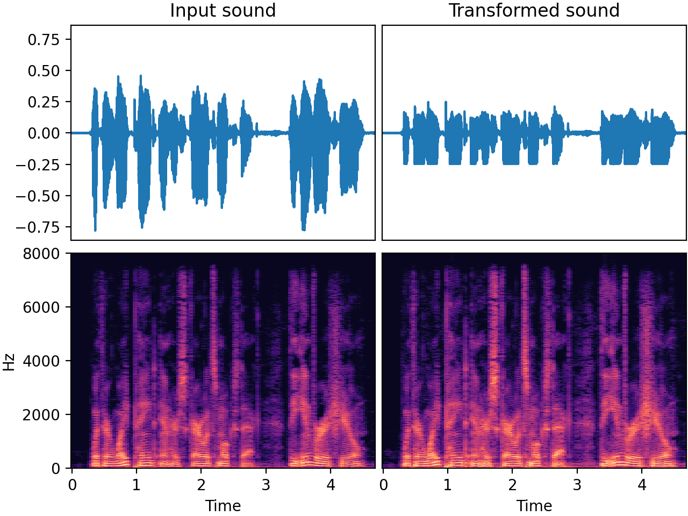

# `Limiter`

_Added in v0.26.0_

The `Limiter`, based on [numpy-audio-limiter :octicons-link-external-16:](https://github.com/iver56/numpy-audio-limiter){target=_blank}, is a straightforward audio transform that applies dynamic range compression.
It is capable of limiting the audio signal based on certain parameters.

* The _threshold_ determines the audio level above which the limiter kicks in.
* The _attack_ time is how quickly the limiter kicks in once the audio signal starts exceeding the threshold.
* The _release_ time determines how quickly the limiter stops working after the signal drops below the threshold.

:warning: In audiomentations v0.35.0 and earlier, this transform introduced a delay in the signal, equivalent to a ~60% of the attack time. Starting from v0.36.0, the output is aligned with the input, i.e. no delay.

:information_source: Note: In audiomentations v0.42.0, the dependency for this transform changed from [cylimiter :octicons-link-external-16:](https://github.com/pzelasko/cylimiter/){target=_blank} to [numpy-audio-limiter :octicons-link-external-16:](https://github.com/iver56/numpy-audio-limiter){target=_blank}, which is ~30% faster and easier to install for newer Python versions. The behavior stays the same, although there are minor numerical differences between the two.

## Input-output example

In this example we apply the limiter with a threshold that is 10 dB lower than the signal peak



| Input sound                                                                          | Transformed sound                                                                             |
|--------------------------------------------------------------------------------------|-----------------------------------------------------------------------------------------------|
| <audio controls><source src="../Limiter_input.flac" type="audio/flac"></audio> | <audio controls><source src="../Limiter_transformed.flac" type="audio/flac"></audio> |

## Usage examples

=== "Threshold relative to signal peak"

    ```python
    from audiomentations import Limiter
    
    transform = Limiter(
        min_threshold_db=-16.0,
        max_threshold_db=-6.0,
        threshold_mode="relative_to_signal_peak",
        p=1.0,
    )
    
    augmented_sound = transform(my_waveform_ndarray, sample_rate=16000)
    ```

=== "Absolute threshold"

    ```python
    from audiomentations import Limiter
    
    transform = Limiter(
        min_threshold_db=-16.0,
        max_threshold_db=-6.0,
        threshold_mode="absolute",
        p=1.0,
    )
    
    augmented_sound = transform(my_waveform_ndarray, sample_rate=16000)
    ```

# Limiter API

[`min_threshold_db`](#min_threshold_db){ #min_threshold_db }: `float` • unit: Decibel
:   :octicons-milestone-24: Default: `-24.0`. Minimum threshold

[`max_threshold_db`](#max_threshold_db){ #max_threshold_db }: `float` • unit: Decibel
:   :octicons-milestone-24: Default: `-2.0`. Maximum threshold

[`min_attack`](#min_attack){ #min_attack }: `float` • unit: seconds
:   :octicons-milestone-24: Default: `0.0005`. Minimum attack time

[`max_attack`](#max_attack){ #max_attack }: `float` • unit: seconds
:   :octicons-milestone-24: Default: `0.025`. Maximum attack time

[`min_release`](#min_release){ #min_release }: `float` • unit: seconds
:   :octicons-milestone-24: Default: `0.05`. Minimum release time

[`max_release`](#max_release){ #max_release }: `float` • unit: seconds
:   :octicons-milestone-24: Default: `0.7`. Maximum release time

[`threshold_mode`](#threshold_mode){ #threshold_mode }: `str` • choices: `"relative_to_signal_peak"`, `"absolute"`
:   :octicons-milestone-24: Default: `relative_to_signal_peak`. Specifies the mode for determining the threshold.

    * `"relative_to_signal_peak"` means the threshold is relative to peak of the signal.
    * `"absolute"` means the threshold is relative to 0 dBFS, so it doesn't depend
     on the peak of the signal.

[`p`](#p){ #p }: `float` • range: [0.0, 1.0]
:   :octicons-milestone-24: Default: `0.5`. The probability of applying this transform.

## Source code :octicons-mark-github-16:

[audiomentations/augmentations/limiter.py :octicons-link-external-16:](https://github.com/iver56/audiomentations/blob/main/audiomentations/augmentations/limiter.py){target=_blank}
