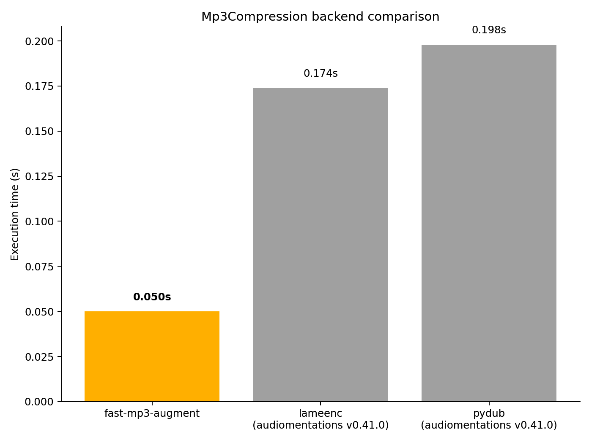

# `Mp3Compression`

_Added in v0.12.0, updated in v0.42.0_

Compress the audio using an MP3 encoder to lower the audio quality. This may help machine
learning models deal with compressed, low-quality audio.

This transform depends on [fast-mp3-augment :octicons-link-external-16:](https://pypi.org/project/fast-mp3-augment/), [lameenc :octicons-link-external-16:](https://pypi.org/project/lameenc/) or [pydub :octicons-link-external-16:](https://pypi.org/project/pydub/)/ffmpeg.

Starting with v0.42.0, the default backend is `"fast-mp3-augment"`, which performs the encode-decode
round-trip entirely in memory and in parallel threads. This makes the transform significantly faster than the older
`"pydub"` and `"lameenc"` backends and avoids writing temporary files to disk. Here's the result from a small benchmark
that ran 3 short audio snippets (~7-9s) through each backend:



Note: When using `"fast-mp3-augment"` or `"lameenc"`, these are the only supported sample rates: 8000, 11025, 12000, 16000, 22050, 24000, 32000, 44100, 48000

## Input-output example

Here we input a high-quality speech recording and apply `Mp3Compression` with a bitrate of 32 kbps:


| Input sound                                                                           | Transformed sound                                                                           |
|---------------------------------------------------------------------------------------|---------------------------------------------------------------------------------------------|
| <audio controls><source src="../Mp3Compression_input.flac" type="audio/flac"></audio> | <audio controls><source src="../Mp3Compression_transformed.flac" type="audio/flac"></audio> | 

## Usage example

```python
from audiomentations import Mp3Compression

transform = Mp3Compression(
    min_bitrate=16,
    max_bitrate=96,
    backend="fast-mp3-augment",
    preserve_delay=False,
    p=1.0
)

augmented_sound = transform(my_waveform_ndarray, sample_rate=48000)
```

# Mp3Compression API

[`min_bitrate`](#min_bitrate){ #min_bitrate }: `int` • unit: kbps • range: [8, `max_bitrate`]
:   :octicons-milestone-24: Default: `8`. Minimum bitrate in kbps

[`max_bitrate`](#max_bitrate){ #max_bitrate }: `int` • unit: kbps • range: [`min_bitrate`, 320]
:   :octicons-milestone-24: Default: `64`. Maximum bitrate in kbps

[`backend`](#backend){ #backend }: `str` • choices: `"fast-mp3-augment"`, `"pydub"`, `"lameenc"`
:   :octicons-milestone-24: Default: `"fast-mp3-augment"`.

    * `"fast-mp3-augment"`: In-memory computation with parallel threads for encoding and decoding. Uses LAME encoder
        and minimp3 decoder under the hood. This is the recommended option.
    
    * `"pydub"`: Uses pydub + ffmpeg under the hood. Does not delay the output compared to the input.
        It is comparatively slow (writes temporary files to disk). Does not support `preserve_delay=True`.
        
        :warning: The `"pydub"` backend is deprecated as of v0.43.0, because pydub appears to have been unmaintained for
        several years, and depends on audioop, which was deprecated in Python 3.11 and removed in 3.13.
    
    * `"lameenc"`: Slow (writes a temporary file to disk). Introduces encoder + decoder delay, so the output is not in sync
        with the input. Does not support `preserve_delay=False`. Note that bitrates below 32 kbps are only supported for
        low sample rates (up to 24000 Hz).
        
        :warning: The `"lameenc"` backend is deprecated as of v0.42.0, because
        backend="fast-mp3-augment" is much faster (by a factor of up to 4x) and uses the same encoder, LAME, under the hood.

[`preserve_delay`](#preserve_delay){ #preserve_delay }: `bool`
:   :octicons-milestone-24: Default: `False`.

    If `False`, the output length and timing will match the input.  
    If `True`, include LAME encoder delay + filter delay (a few tens of milliseconds) and padding in the output.
    This makes the output  
    1) longer than the input  
    2) delayed (out of sync) relative to the input

    Normally, it makes sense to set `preserve_delay` to `False`, but if you want outputs that include the
    short, almost silent part in the beginning, you here have the option to get that.

[`quality`](#quality){ #quality }: `int` • range: [0, 9]
:   :octicons-milestone-24: Default: `7`. LAME-specific parameter (between 0 and 9) that controls a trade-off
    between audio quality and speed:  
    0: higher quality audio at the cost of slower processing  
    9: faster processing at the cost of lower quality audio
    
    Note: If using `backend="pydub"`, this parameter gets silently ignored.

[`p`](#p){ #p }: `float` • range: [0.0, 1.0]
:   :octicons-milestone-24: Default: `0.5`. The probability of applying this transform.

## Source code :octicons-mark-github-16:

[audiomentations/augmentations/mp3_compression.py :octicons-link-external-16:](https://github.com/iver56/audiomentations/blob/main/audiomentations/augmentations/mp3_compression.py){target=_blank}
