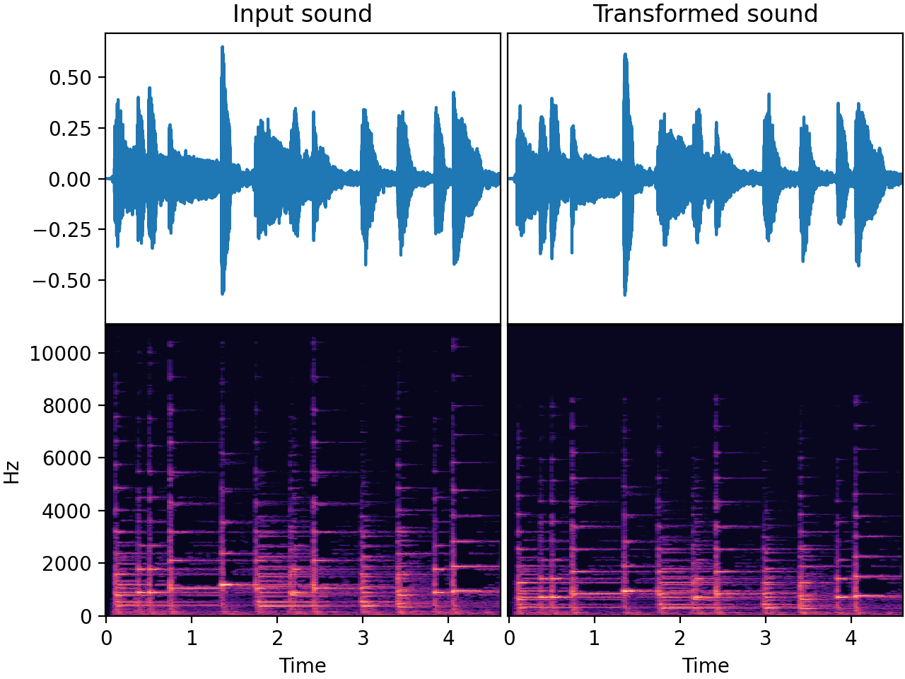

# `PitchShift`

_Added in v0.4.0_

Pitch shift the sound up or down without changing the tempo.

Under the hood this does time stretching (by phase vocoding) followed by resampling.
Note that phase vocoding can degrade audio quality by "smearing" transient sounds,
altering the timbre of harmonic sounds, and distorting pitch modulations. This may
result in a loss of sharpness, clarity, or naturalness in the transformed audio.

## Input-output example

Here we pitch down a piano recording by 4 semitones:



| Input sound                                                                           | Transformed sound                                                                           |
|---------------------------------------------------------------------------------------|---------------------------------------------------------------------------------------------|
| <audio controls><source src="../PitchShift_input.flac" type="audio/flac"></audio> | <audio controls><source src="../PitchShift_transformed.flac" type="audio/flac"></audio> | 

## Usage example

```python
from audiomentations import PitchShift

transform = PitchShift(
    min_semitones=-5.0,
    max_semitones=5.0,
    p=1.0
)

augmented_sound = transform(my_waveform_ndarray, sample_rate=44100)
```

# PitchShift API

[`min_semitones`](#min_semitones){ #min_semitones }: `float` • unit: semitones • range: [-12.0, 12.0]
:   :octicons-milestone-24: Default: `-4.0`. Minimum semitones to shift. Negative number means shift down.

[`max_semitones`](#max_semitones){ #max_semitones }: `float` • unit: semitones • range: [-12.0, 12.0]
:   :octicons-milestone-24: Default: `4.0`. Maximum semitones to shift. Positive number means shift up.

[`p`](#p){ #p }: `float` • range: [0.0, 1.0]
:   :octicons-milestone-24: Default: `0.5`. The probability of applying this transform.
