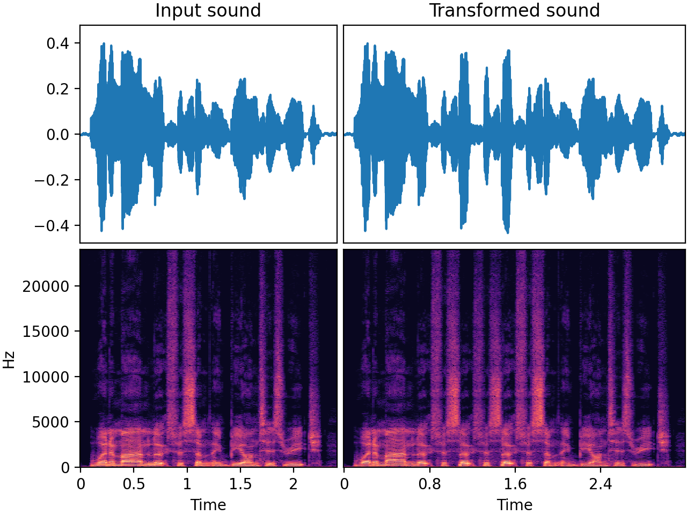

# `RepeatPart`

_Added in v0.32.0_

Select a subsection (or "part") of the audio and repeat that part a number of times.
This can be useful when simulating scenarios where a short audio snippet gets
repeated, for example:

* Repetitions of some musical note or sound in a rhythmical way
* A person stutters or says the same word (with variations) multiple times in a row
* A mechanical noise with periodic repetitions
* A "skip in the record" or a "stuck needle" effect, reminiscent of vinyl records or
  CDs when they repeatedly play a short section due to a scratch or other
  imperfection.
* Digital audio glitches, such as a buffer underrun in video games,
  where the current audio frame gets looped continuously due to system overloads
  or a software crash.

Note that the length of inputs you give it must be compatible with the part
duration range and crossfade duration. If you give it an input audio array that is
too short, a `UserWarning` will be raised and no operation is applied to the signal.

## Input-output example

In this speech example, the audio was transformed with

* a part duration of approximately 0.4 seconds
* "insert" mode. In this mode, the output becomes longer than the input.
* a `SevenBandParametricEQ` part transform. This is why each repeat in the output
  has a different timbre.



| Input sound                                                                           | Transformed sound                                                                           |
|---------------------------------------------------------------------------------------|---------------------------------------------------------------------------------------------|
| <audio controls><source src="../RepeatPart_input.flac" type="audio/flac"></audio> | <audio controls><source src="../RepeatPart_transformed.flac" type="audio/flac"></audio> | 

## Usage examples

=== "Insert mode"

    ```python
    from audiomentations import RepeatPart
    
    transform = RepeatPart(mode="insert", p=1.0)
    
    augmented_sound = transform(my_waveform_ndarray, sample_rate=16000)
    ```

=== "Replace mode"

    ```python
    from audiomentations import RepeatPart

    transform = RepeatPart(mode="replace", p=1.0)
    
    augmented_sound = transform(my_waveform_ndarray, sample_rate=16000)
    ```

# RepeatPart API

[`min_repeats`](#min_repeats){ #min_repeats }: `int` • range: [1, `max_repeats`]
:   :octicons-milestone-24: Default: `1`. Minimum number of times a selected audio
  segment should be repeated in addition to the original. For instance, if the selected
  number of repeats is 1, the selected segment will be followed by one repeat.

[`max_repeats`](#max_repeats){ #max_repeats }: `int` • range: [`min_repeats`, ∞)
:   :octicons-milestone-24: Default: `3`. Maximum number of times a selected audio
  segment can be repeated in addition to the original

[`min_part_duration`](#min_part_duration){ #min_part_duration }: `float` • unit: seconds • range: [0.00025, `max_part_duration`]
:   :octicons-milestone-24: Default: `0.25`. Minimum duration (in seconds) of the audio
  segment that can be selected for repetition.

[`max_part_duration`](#max_part_duration){ #max_part_duration }: `float` • unit: seconds • range: [`min_part_duration`, ∞)
:   :octicons-milestone-24: Default: `1.2`. Maximum duration (in seconds) of the audio
  segment that can be selected for repetition.

[`mode`](#mode){ #mode }: `str` • choices: `"insert"`, `"replace"`
:   :octicons-milestone-24: Default: `"insert"`. This parameter has two options:

    * `"insert"`: Insert the repeat(s), making the array longer. After the last
      repeat there will be the last part of the original audio, offset in time
      compared to the input array.
    * `"replace"`: Have the repeats replace (as in overwrite) the original audio.
      Any remaining part at the end (if not overwritten by repeats) will be
      left untouched without offset. The length of the output array is the
      same as the input array.

[`crossfade_duration`](#crossfade_duration){ #crossfade_duration }: `float` • unit: seconds • range: 0.0 or [0.00025, ∞)
:   :octicons-milestone-24: Default: `0.005`. Duration for crossfading between repeated
  parts as well as potentially from the original audio to the repeats and back.
  The crossfades will be equal-energy or equal-gain depending on the audio and/or the
  chosen parameters of the transform. The crossfading feature can be used to smooth
  transitions and avoid abrupt changes, which can lead to impulses/clicks in the audio.
  If you know what you're doing, and impulses/clicks are desired for your use case,
  you can disable the crossfading by setting this value to `0.0`.

[`part_transform`](#part_transform){ #part_transform }: `Optional[Callable[[NDArray[np.float32], int], NDArray[np.float32]]]`
:   :octicons-milestone-24: An optional callable (audiomentations transform) that
  gets applied individually to each repeat. This can be used to make each
  repeat slightly different from the previous one. Note that a `part_transform`
  that makes the part shorter is only supported if the transformed part is at
  least two times the crossfade duration.

[`p`](#p){ #p }: `float` • range: [0.0, 1.0]
:   :octicons-milestone-24: Default: `0.5`. The probability of applying this transform.

## Source code :octicons-mark-github-16:

[audiomentations/augmentations/repeat_part.py :octicons-link-external-16:](https://github.com/iver56/audiomentations/blob/main/audiomentations/augmentations/repeat_part.py){target=_blank}
