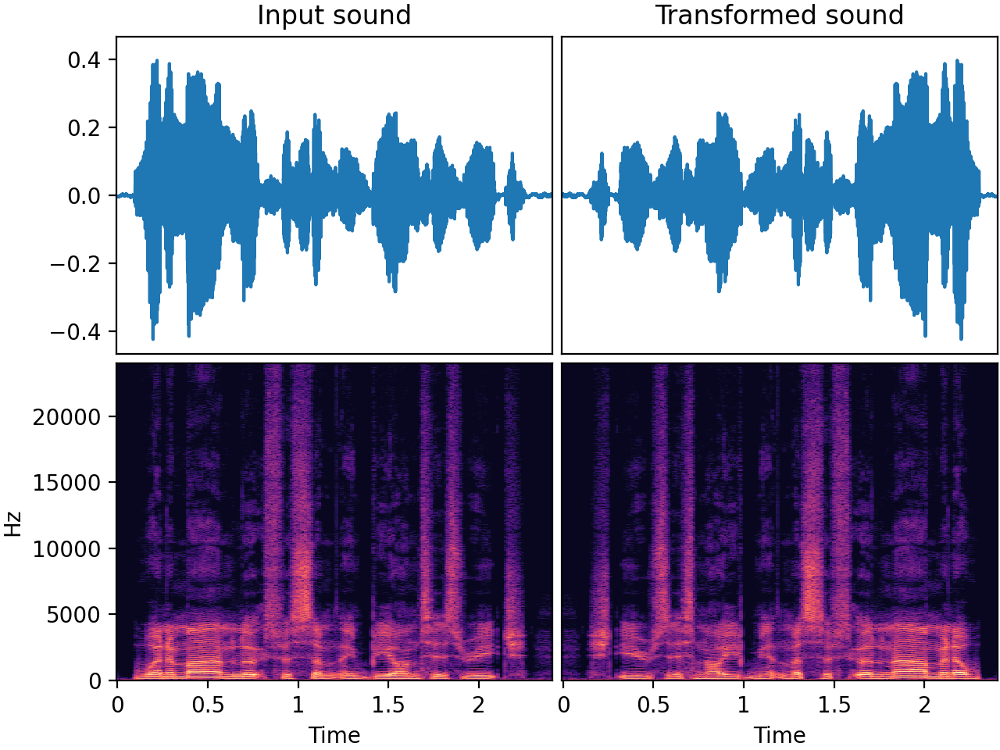

# `Reverse`

_Added in v0.18.0_

Reverse the audio, also known as time inversion. Inversion of an audio track along its time axis is
analogous to the random flip of an image, an augmentation technique widely used in the visual domain.
This can be relevant in the context of audio classification. It was successfully applied in the paper
[AudioCLIP: Extending CLIP to Image, Text and Audio :octicons-link-external-16:](https://arxiv.org/pdf/2106.13043.pdf){target=_blank}.

> **Note for PyTorch users**  
> This transform returns a negative-stride array for efficiency. If you intend to convert the reversed
> waveform to a PyTorch tensor via `torch.from_numpy()`, you must make the array contiguous first:
> ```python
> reversed_waveform = transform(my_waveform_ndarray, sample_rate=44100)
> reversed_waveform = reversed_waveform.copy()  # or use np.ascontiguousarray
> tensor = torch.from_numpy(reversed_waveform)
> ```

## Input-output example

In this example, we reverse a speech recording



| Input sound                                                                           | Transformed sound                                                                           |
|---------------------------------------------------------------------------------------|---------------------------------------------------------------------------------------------|
| <audio controls><source src="../Reverse_input.flac" type="audio/flac"></audio> | <audio controls><source src="../Reverse_transformed.flac" type="audio/flac"></audio> | 

## Usage example

```python
from audiomentations import Reverse

transform = Reverse(p=1.0)

augmented_sound = transform(my_waveform_ndarray, sample_rate=44100)
```

# Reverse API

[`p`](#p){ #p }: `float` • range: [0.0, 1.0]
:   :octicons-milestone-24: Default: `0.5`. The probability of applying this transform.


## Source code :octicons-mark-github-16:

[audiomentations/augmentations/reverse.py :octicons-link-external-16:](https://github.com/iver56/audiomentations/blob/main/audiomentations/augmentations/reverse.py){target=_blank}
