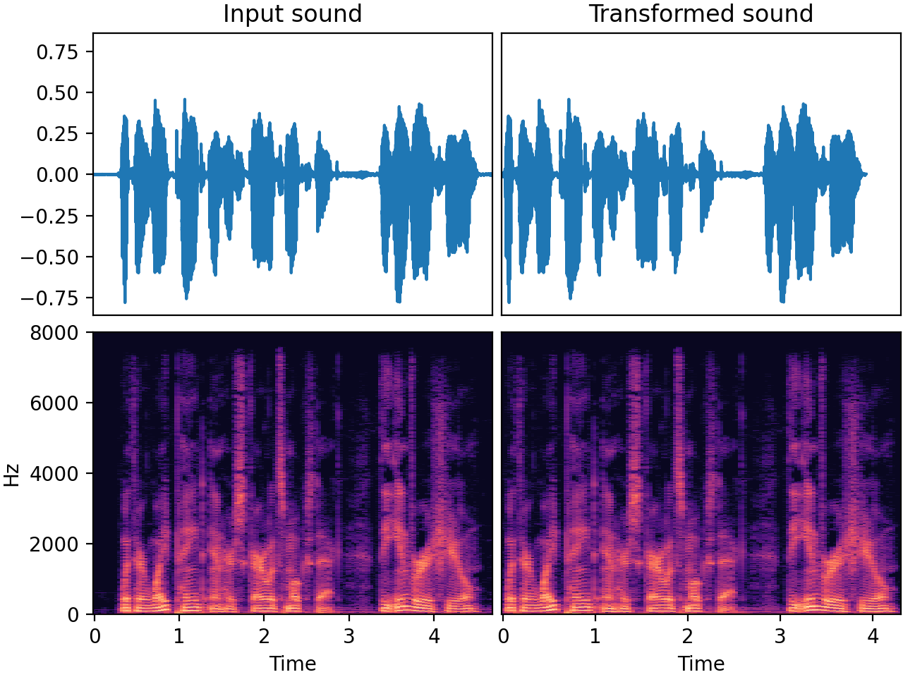

# `Trim`

_Added in v0.7.0_

Trim leading and trailing silence from an audio signal using `librosa.effects.trim`. It considers threshold
(in decibels) below reference defined in parameter `top_db` as silence.

## Input-output examples



| Input sound                                                                             | Transformed sound                                                                             |
|-----------------------------------------------------------------------------------------|-----------------------------------------------------------------------------------------------|
| <audio controls><source src="../Trim_input.flac" type="audio/flac"></audio> | <audio controls><source src="../Trim_transformed.flac" type="audio/flac"></audio> |

## Usage example

```python
from audiomentations import Trim

transform = Trim(
    top_db=30.0,
    p=1.0
)

augmented_sound = transform(my_waveform_ndarray, sample_rate=16000)
```

## Trim API

[`top_db`](#top_db){ #top_db }: `float` • unit: Decibel
:   :octicons-milestone-24: Default: `30.0`. The threshold value (in decibels) below which to consider silence and trim.

[`p`](#p){ #p }: `float`
:   :octicons-milestone-24: Default: `0.5`. The probability of applying this transform.
